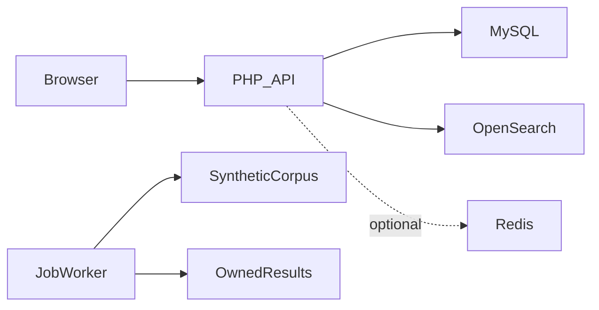

# MisterX

**بحث نصي مفهرس ومعالجة في الخلفية**

[English](README.md)

توفير بحث نصي مفهرس ومسار مسح غير متزامن مستقل مع حسابات وحدود وإدارة نتائج.

**التقنيات:** PHP · OpenSearch · MySQL · optional Redis · background jobs

## الحالة والتاريخ

مشروع لعرض هندسة البحث. تستخدم الأمثلة العامة سجلات مولدة ومصرحاً بها فقط؛ لا تُنشر مجموعات المصدر أو النتائج الخاصة.

هذه نسخة عرض منقحة للنشر. تعرض [وثيقة التحقق](docs/verification.ar.md) الفحوص الحالية بصورة مستقلة عن النشر السابق.

## الوظائف والإجراءات

- مسار بحث OpenSearch فعال
- أدوات إدخال وفهرسة المستندات
- ترقيم صفحات ومعالجة search_after
- تخزين Redis اختياري وإبطاله
- مسح ملفات تاريخي ووظائف وتقدم ونتائج
- اشتراكات وإدارة حسابات وحدود استخدام

إدخال سجلات اصطناعية مصرح بها ← بحث مفهرس بنتائج مقسمة؛ ينشئ المسار غير المتزامن وظيفة ويمسح مجموعتها ويعرض التقدم ونتائج تخص صاحبها.

## البنية

## القرارات الهندسية

- البحث المفهرس ومسح الملفات مساران مختلفان. وجود أدوات الوظائف لا يجعلها تحويلاً تلقائياً عند تعطل OpenSearch.
- يصرح Composer الآن بعميل OpenSearch المطلوب. يجب ضبط الفهرس؛ الافتراضي العام هو portfolio_records.
- تبقى المعرفات التاريخية مثل LEAKED_DATA_PATH للتوافق مع توثيق معناها.
- استُبدل استثناء حساب شخصي غير محدود بقائمة بيئة فارغة افتراضياً.
- الغرض التعليمي لا يبيح معالجة معلومات خاصة. بند ضمان MIT ليس وعداً بالإعفاء من المسؤولية.

## المجلدات

| المكون | المسؤولية |
|---|---|
| `api/search/` | مسارات البحث المفهرس والوظائف |
| `api/utils/` | عميل وفهرسة OpenSearch وعمال الملفات والوظائف |
| `api/admin/` | واجهة الإدارة |
| `database*.sql` | مخططات الحسابات والدعم والوظائف |
| `js/` | عميل API وأدوات الواجهة |

## التثبيت والإعداد

ثبّت PHP 8.1 وComposer وMySQL وOpenSearch. نفذ `composer install` واستورد مخططات الحسابات والوظائف والدعم بالترتيب المذكور بعد فحص الاعتماديات. اضبط قاعدة البيانات ومفتاح JWT والفهرس portfolio_records ومسار مجموعة مولدة فقط. Redis اختياري. افحص خيارات المفهرس قبل الإدخال ولا تستخدم مسارات إنتاج تاريخية.

توجد أوامر التشغيل ومتغيرات البيئة في [دليل الإعداد](docs/setup.ar.md). القيم أمثلة محلية أو حقول فارغة؛ لا تعِد استخدام بيانات إنتاج سابقة.

## العرض والتحقق

إدخال سجلات اصطناعية مصرح بها ← بحث مفهرس بنتائج مقسمة؛ ينشئ المسار غير المتزامن وظيفة ويمسح مجموعتها ويعرض التقدم ونتائج تخص صاحبها.

استخدم حسابات وسجلات اصطناعية. راجع [خطوات العرض](docs/demo.ar.md) وسجل نتائج الفحوص الحالية. نجاح بناء مكون لا يثبت نجاح كل مسارات المنتج.

## الحدود

لا تُنشر أرقام أداء للفهرسة قبل تنفيذ فحوص OpenSearch والقياس الاصطناعي. تبقى أعطال Redis وOpenSearch والصفحات واتساق مسارات الملفات والفهرسة حدوداً للإصدار. تُستخدم بيانات اصطناعية مصرح بها فقط.

## التوثيق

- [البنية](docs/architecture.ar.md)
- [الإعداد](docs/setup.ar.md)
- [العرض](docs/demo.ar.md)
- [المسارات](docs/api.ar.md)
- [الفحوص الحالية](docs/verification.ar.md)
- [النشر وحل المشكلات](docs/deployment.ar.md)
- [حقوق الأصول](THIRD_PARTY_NOTICES.md)

## المساهمة والترخيص

افتح مشكلة تتضمن خطوات إعادة الإنتاج والمكون المعني. استخدم بيانات اصطناعية وتعديلات مركزة وفحوصاً مناسبة، ولا ترسل أسراراً أو سجلات مستخدمين خاصة. الشيفرة بترخيص [MIT](LICENSE)، وتحتفظ الاعتماديات والأصول الخارجية بشروطها الأصلية.

## التحقق والقراءة المتعمقة

نجحت صياغة PHP وتثبيت Composer المتوافق وإنشاء MariaDB اصطناعية. أصلحت المراجعة نوع ربط نص البحث وفحص ملكية الوظيفة قبل التنفيذ وإضافة الفهرس ومؤشر الصفحة إلى مفتاح Redis. أُرفقت فحوص فهرسة وصفحات وتخزين OpenSearch لكنها لم تُنفذ بنجاح في البيئة الحالية.

لا تُنشر أرقام أداء للفهرسة قبل تنفيذ فحوص OpenSearch والقياس الاصطناعي. تبقى أعطال Redis وOpenSearch والصفحات واتساق مسارات الملفات والفهرسة حدوداً للإصدار. تُستخدم بيانات اصطناعية مصرح بها فقط.

- [دراسة المشروع](docs/case-study.ar.md)
- [التحقق](docs/verification.ar.md)
- [مخطط البنية](docs/architecture.svg)
- [صفحة المشروع](https://mohamed-abderrehmane-portfolio.hillock-factual9mupt.chatgpt.site/ar/projects/misterx-search/)

<!-- release-presentation -->

## من التطبيق الفعلي

هذه لقطة فعلية للواجهة المحلية، وليست دليلاً على استخدام إنتاجي أو فحص أندرويد.

## التحقق والقراءة المتعمقة

نجحت صياغة PHP وتثبيت Composer المتوافق وإنشاء MariaDB اصطناعية. أصلحت المراجعة نوع ربط نص البحث وفحص ملكية الوظيفة قبل التنفيذ وإضافة الفهرس ومؤشر الصفحة إلى مفتاح Redis. أُرفقت فحوص فهرسة وصفحات وتخزين OpenSearch لكنها لم تُنفذ بنجاح في البيئة الحالية.

لا تُنشر أرقام أداء للفهرسة قبل تنفيذ فحوص OpenSearch والقياس الاصطناعي. تبقى أعطال Redis وOpenSearch والصفحات واتساق مسارات الملفات والفهرسة حدوداً للإصدار. تُستخدم بيانات اصطناعية مصرح بها فقط.

- [دراسة المشروع](docs/case-study.ar.md)
- [التحقق](docs/verification.ar.md)
- [مخطط البنية](docs/architecture.svg)
- [صفحة المشروع](https://mohamed-abderrehmane-portfolio.hillock-factual9mupt.chatgpt.site/ar/projects/misterx-search/)

- [تفاصيل هندسية ودروس التنفيذ](docs/engineering-notes.ar.md)
