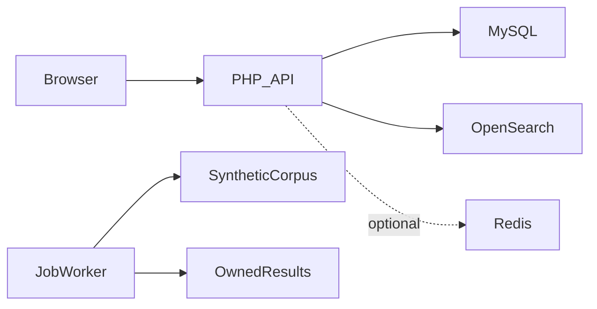
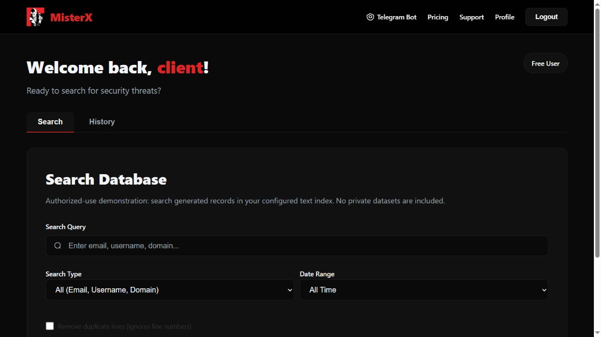

# MisterX

**Indexed text search and background processing**

[العربية](README.ar.md)

Provide indexed text lookup and a separate asynchronous scanning path with accounts, limits and result management.

**Technology:** PHP · OpenSearch · MySQL · optional Redis · background jobs

## Status and deployment history

Search engineering showcase. Public examples use generated, authorized records only; no original corpus or private search results are included.

This is a sanitized portfolio release. See the current [verification record](docs/verification.md) before choosing a runtime demonstration.

## Main workflows and implemented features

- Active OpenSearch search route
- Ingestion utilities and document indexing
- Pagination and search_after handling
- Optional Redis caching and invalidation
- Legacy file scanning, job polling/progress/results
- Subscriptions, account administration and usage limits

Authorized synthetic records are ingested → indexed search returns paginated results; the retained asynchronous path creates a job, scans its corpus, reports progress and returns owner-scoped output.

## Architecture

## Engineering decisions

- Indexed retrieval and direct file scanning are different execution paths. OpenSearch availability determines the active indexed route; keeping old job utilities does not make them automatic failover.
- Composer now declares the missing OpenSearch PHP client. Configure the index explicitly; the public default is `portfolio_records`.
- Legacy identifiers such as LEAKED_DATA_PATH remain in the source for compatibility and are documented, rather than presented as new terminology.
- A hard-coded personal unlimited-account exception is replaced with an empty-by-default environment allowlist.
- Educational intent does not authorize processing private information. The MIT warranty clause is not a promise of immunity.

## Directory guide

| Component | Responsibility |
|---|---|
| `api/search/` | Indexed search and job endpoints |
| `api/utils/` | OpenSearch client/indexer and file/job workers |
| `api/admin/` | Administrative API |
| `database*.sql` | Account, support and job schema |
| `js/` | Browser API client and interface helpers |

## Installation

Install PHP 8.1+, Composer, MySQL and OpenSearch. Run `composer install`, import `database.sql`, `database_search_jobs.sql` and `database_support_tickets.sql` in that order after reviewing their schema dependencies. Export database variables, a new JWT secret, `OPENSEARCH_HOST`, `OPENSEARCH_PORT`, `OPENSEARCH_INDEX=portfolio_records` and `LEAKED_DATA_PATH` pointing only to the generated corpus. Configure optional Redis separately. Inspect indexer options before invoking ingestion; do not use historical production paths.

All required/private configuration is described in [setup](docs/setup.md). Examples contain placeholders or local demo values. Never reuse historical credentials.

## Demonstration

- Generate harmless synthetic event logs.
- Index the records and compare first/next search pages.
- Run the retained asynchronous path and inspect progress and ownership.
- Disable OpenSearch intentionally; record the indexed-route error separately from the file path.

## Verification and limitations

- PHP syntax and Composer setup
- Pagination, cache behavior and unavailable index service
- Job ownership and limits
- Measured warm/cold-cache benchmark only after running the documented procedure

No speed, terabyte-scale, document-count or legal-compliance claims are made. Integration checks need disposable OpenSearch/MySQL services. Publish no credential collections or private datasets.

## Documentation

- [Architecture](docs/architecture.md) · [العربية](docs/architecture.ar.md)
- [Setup and configuration](docs/setup.md) · [العربية](docs/setup.ar.md)
- [Demo walkthrough](docs/demo.md) · [العربية](docs/demo.ar.md)
- [API and execution paths](docs/api.md)
- [Verification record](docs/verification.md)
- [Deployment and troubleshooting](docs/deployment.md)
- [Asset attribution](THIRD_PARTY_NOTICES.md) · [MIT license](LICENSE)

## Contributing

Open an issue describing a reproducible problem, expected behavior and component involved. Use synthetic data. Keep changes focused and include relevant checks. Do not include credentials or private user records.

## License and attribution

Source code is MIT licensed. Third-party dependencies and assets retain their own terms; see [attribution](THIRD_PARTY_NOTICES.md).

## Verification and deeper reading

PHP syntax, compatible Composer installation and fresh MariaDB synthetic bootstrap passed. I fixed query parameter binding, moved job ownership validation before processing, and added index/cursor values to Redis cache keys. OpenSearch ingestion/pagination/cache checks are provided but have not executed successfully in the current environment.

No indexed performance figures are published until the supplied OpenSearch checks and generated-corpus benchmark actually run. Redis and OpenSearch failure behavior, pagination and indexed/file result consistency remain release limitations. Only authorized synthetic records may be used.

- [Case study](docs/case-study.md)
- [Verification](docs/verification.md)
- [Architecture diagram](docs/architecture.svg)
- [Portfolio case study](https://mohamedabderrehmane.netlify.app/projects/misterx-search/)

<!-- release-presentation -->

## Actual application interface

Captured from the local application with synthetic records. This does not establish production usage or Android device verification.

## Verification and deeper reading

PHP syntax, compatible Composer installation and fresh MariaDB synthetic bootstrap passed. I fixed query parameter binding, moved job ownership validation before processing, and added index/cursor values to Redis cache keys. OpenSearch ingestion/pagination/cache checks are provided but have not executed successfully in the current environment.

No indexed performance figures are published until the supplied OpenSearch checks and generated-corpus benchmark actually run. Redis and OpenSearch failure behavior, pagination and indexed/file result consistency remain release limitations. Only authorized synthetic records may be used.

- [Case study](docs/case-study.md)
- [Verification](docs/verification.md)
- [Architecture diagram](docs/architecture.svg)
- [Portfolio case study](https://mohamedabderrehmane.netlify.app/projects/misterx-search/)

- [Engineering details and implementation lessons](docs/engineering-notes.md)
