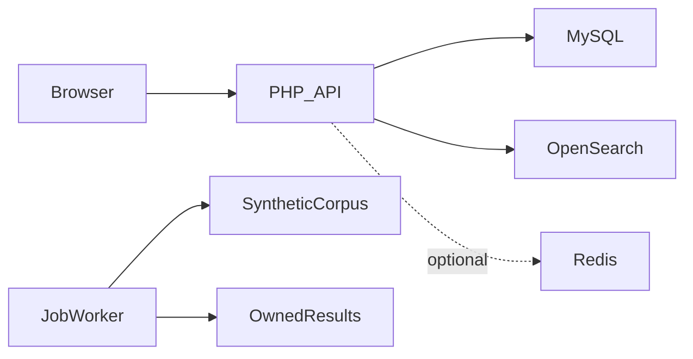

# بنية MisterX

إدخال سجلات اصطناعية مصرح بها ← بحث مفهرس بنتائج مقسمة؛ ينشئ المسار غير المتزامن وظيفة ويمسح مجموعتها ويعرض التقدم ونتائج تخص صاحبها.

## القرارات والمفاضلات

- البحث المفهرس ومسح الملفات مساران مختلفان. وجود أدوات الوظائف لا يجعلها تحويلاً تلقائياً عند تعطل OpenSearch.
- يصرح Composer الآن بعميل OpenSearch المطلوب. يجب ضبط الفهرس؛ الافتراضي العام هو portfolio_records.
- تبقى المعرفات التاريخية مثل LEAKED_DATA_PATH للتوافق مع توثيق معناها.
- استُبدل استثناء حساب شخصي غير محدود بقائمة بيئة فارغة افتراضياً.
- الغرض التعليمي لا يبيح معالجة معلومات خاصة. بند ضمان MIT ليس وعداً بالإعفاء من المسؤولية.

## مراجع الشيفرة

- [api/search/index.php](../api/search/index.php)
- [api/utils/OpenSearchClient.php](../api/utils/OpenSearchClient.php)
- [api/utils/opensearch_indexer.php](../api/utils/opensearch_indexer.php)
- [api/utils/fast_search.php](../api/utils/fast_search.php)
- [api/utils/process_search_job.php](../api/utils/process_search_job.php)

## الحدود

لا ندعي سرعة أو حجم تيرابايت أو أعداد مستندات أو امتثالاً قانونياً عاماً. تتطلب الفحوص المتكاملة خدمات اختبار OpenSearch وMySQL. لا تُنشر مجموعات خاصة.
