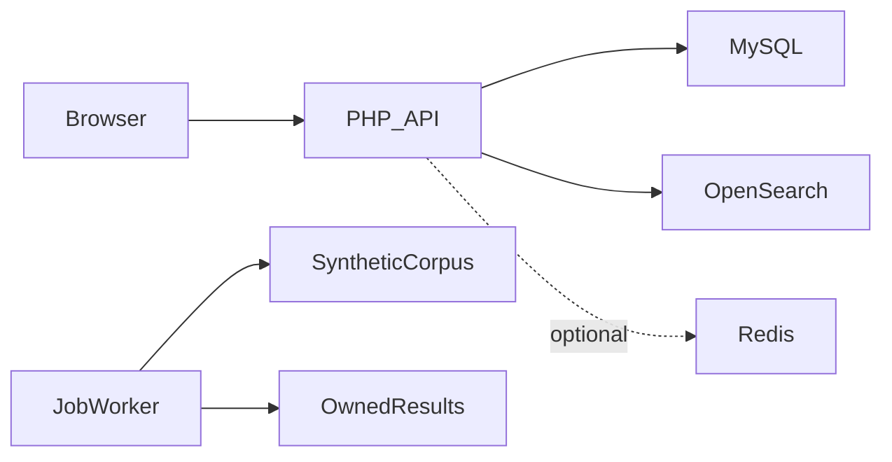

# MisterX architecture

Authorized synthetic records are ingested → indexed search returns paginated results; the retained asynchronous path creates a job, scans its corpus, reports progress and returns owner-scoped output.

## Decisions and tradeoffs

- Indexed retrieval and direct file scanning are different execution paths. OpenSearch availability determines the active indexed route; keeping old job utilities does not make them automatic failover.
- Composer now declares the missing OpenSearch PHP client. Configure the index explicitly; the public default is `portfolio_records`.
- Legacy identifiers such as LEAKED_DATA_PATH remain in the source for compatibility and are documented, rather than presented as new terminology.
- A hard-coded personal unlimited-account exception is replaced with an empty-by-default environment allowlist.
- Educational intent does not authorize processing private information. The MIT warranty clause is not a promise of immunity.

## Component boundaries

| Component | Responsibility |
|---|---|
| `api/search/` | Indexed search and job endpoints |
| `api/utils/` | OpenSearch client/indexer and file/job workers |
| `api/admin/` | Administrative API |
| `database*.sql` | Account, support and job schema |
| `js/` | Browser API client and interface helpers |

## Source evidence

- [api/search/index.php](../api/search/index.php)
- [api/utils/OpenSearchClient.php](../api/utils/OpenSearchClient.php)
- [api/utils/opensearch_indexer.php](../api/utils/opensearch_indexer.php)
- [api/utils/fast_search.php](../api/utils/fast_search.php)
- [api/utils/process_search_job.php](../api/utils/process_search_job.php)

## Limits

No speed, terabyte-scale, document-count or legal-compliance claims are made. Integration checks need disposable OpenSearch/MySQL services. Publish no credential collections or private datasets.
